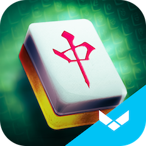
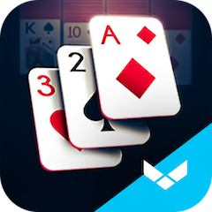
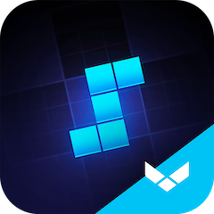
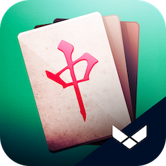

## We make tiles, cards, Sudoku, blocks, ETFs, portfolios, simulations, and games designed by players for players.

### Mahjong Gold

Mahjong is a relaxing, casual board game perfect for passing the time, whether you only have a few minutes or several hours. The goal is to match pairs of tiles to clear the board. Use strategy and match the tiles in the correct order to remove them all. It’s the perfect blend of logic and relaxation, great for players of all ages!

<ul class="fa-ul">
  <li><i class="fa-li fa fa-brands fa-apple"></i><a href="https://itunes.apple.com/app/id880605393?mt=8&ct=players.one">Download on the App Store</a></li>
  <li><i class="fa-li fa fa-brands fa-play"></i><a href="https://play.google.com/store/apps/details?id=mobi.redstonegames.redstonemahjong">Get it on Google Play</a></li>
</ul>

> "This is the best Mahjong game out there . You can get lots of great levels to play with great choices in tiles .and it gives you automatic shuffling if you need it..I'm so addicted to this game..Download it and play it ....It'll be your favorite game as well..Great job !! to the creators of this game.I like the way you can make the tiles smaller and easier to see the whole puzzle....."

> "Relieve the stress of my mind. 5 Stars."

### Klondike Solitaire

If you love Windows Solitaire (also known as Patience), you're going to love our Solitaire even more! Play the most popular Solitaire card game in the world right now on your phone or tablet. It's free and perfect for many hours of fun!

<ul class="fa-ul">
  <li><i class="fa-li fa fa-brands fa-apple"></i><a href="https://itunes.apple.com/app/id815772160?mt=8&ct=players.one">Download on the App Store</a></li>
  <li><i class="fa-li fa fa-brands fa-play"></i><a href="https://play.google.com/store/apps/details?id=com.casualon.games.klondikesolitaire">Get it on Google Play</a></li>
</ul>

> "THE BEST solitaire app. Believe me, I've tried them all so you don't have to. The ads are minimal, they really didn't bother me, but I paid to remove them to support the company."

> "It's solitaire, what more can you say? The UI is sleek and it isn't bogged down by extra modes or complexities. I appreciate the inclusion of "hints" - which gives you a hidden card if you get stuck with no other options - but I honestly enjoying building them up more than spending them."

> "Very addictive but simple once you get the advantage of the Joker's."

### Sudoku Blocks

Sudoku Blocks is a challenging yet relaxing puzzle game you won’t be able to put aside. Keep the board clean by matching blocks to complete lines and squares. Improve your high score and challenge your friends.

<ul class="fa-ul">
  <li><i class="fa-li fa fa-brands fa-apple"></i><a href="https://apps.apple.com/app/id6443567882?ct=players.one">Download on the App Store</a></li>
  <li><i class="fa-li fa fa-brands fa-play"></i><a href="https://play.google.com/store/apps/details?id=one.players.sudokublocks">Get it on Google Play</a></li>
</ul>

> "A good mix of skill, strategy, and luck. The graphics are well-designed and modern. Surprisingly fun."

> "Like most of these classic jewel block puzzle games, this one is excellent for special needs individuals like me with autism, as it is terrific for teaching perceptual skills. Additionally, the Sudoku blocks add an extra challenge, making the whole layout absolutely terrific. I am so proud to have this game on my very own cell phone. Do keep up the great work; this game is excellent and fun to play."

### Shanghai Majong

Whether you only have a few minutes to spend, or hours, this is a classic Chinese game with simple rules and relaxing gameplay, available on your mobile devices! In addition to being a fun way to pass the time, Mahjong Solitaire is also a great way to support health by developing concentration, improving cognition, increasing memory skills and decreasing anxiety. This game is also known as Mah Jongg, Mah Jong, Mah-jong, Majong, Mahjongg, Mahjongg, Kyodai, Majiang or Taipei.

<ul class="fa-ul">
  <li><i class="fa-li fa fa-brands fa-apple"></i><a href="https://itunes.apple.com/app/id1187641822?mt=8&ct=players.one">Download on the App Store</a></li>
  <li><i class="fa-li fa fa-brands fa-play"></i><a href="https://play.google.com/store/apps/details?id=mobi.redstonegames.mahjongsolitaire">Get it on Google Play</a></li>
</ul>

> "Beautiful tiles. Some ads as you finish a layout and challenge, but I don't find them bothersome. Attempts to get you to buy the ad-free game, but again I am not bothered. I play daily. Calming. Enjoyable."

> "This game is very fun to play, and I think the tiles are very cool, so have some fun and play it when you get a chance to play it."

### Players Simulator

With this investment simulator (using fictitious money), learn how to invest in practice and develop your financial independence (Brazilian app stores only).

<ul class="fa-ul">
  <li><i class="fa-li fa fa-brands fa-apple"></i><a href="https://apps.apple.com/app/id6468494664?ct=players.one">Download on the App Store</a></li>
  <li><i class="fa-li fa fa-brands fa-play"></i><a href="https://play.google.com/store/apps/details?id=one.players.simulator">Get it on Google Play</a></li>
</ul>

#### Join us.

We're seeking collaborators who are lovers of what they do. We're always [hiring](mailto:website@players.one) for all positions.

Copyright © Players Games

Theme by [Good Clean Read](https://github.com/adueck/good-clean-read)
